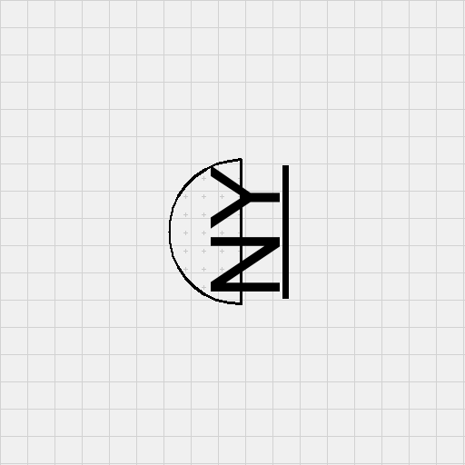

# Synthetic OCR Dataset Generation for Mechanical Floor Plans

## Overview

This repository provides an automated pipeline for generating a high-volume synthetic dataset tailored for optical character recognition (OCR) in mechanical floor plan contexts. The dataset includes:
- **Alphanumeric tag strings** in various styles.
- **Rotated (sideways) text** to mimic text alignment in plans.
- **Underlined text** to address model biases.
- **Text on visually noisy backgrounds** matching floor plan diagrams.
- **Text within simple icons** to simulate equipment tagging.

These synthetic images are accompanied by JSON annotations containing:
1. Image path  
2. Bounding box coordinates  
3. OCR text (ground truth)  
4. Rotation angle  
5. Shape type (if any)

## Features

1. **Realistic Background Patterns**  
   Grid, dots, crosses, or diagonal lines are used to simulate cluttered or technical drawings.

2. **Scalable Generation**  
   With default settings on a single CPU core, approximately 2,000 samples can be generated per minute—enough to exceed 3 million samples in 24 hours, ensuring coverage of more than 500k samples well within a single day.

3. **Alphanumeric & Symbolic Text**  
   Generations include customizable separators ( `-`, `_`, `.`, etc. ), varied lengths, and random fonts to mimic mechanical plan labels.

4. **Rotation and Underlines**  
   Text may appear at 0°, 90°, or 270° orientation and often comes with optional underlines, as is common in floor plan notations.

5. **Icons & Shapes**  
   Simple geometric shapes (rectangles, triangles, circles, etc.) are drawn behind or around text to replicate equipment tags and icons often found on mechanical drawings.

## Installation and Requirements

1. **Clone** or download this repository.  
2. **Install Python 3.8 or higher**.  
3. **Install dependencies**:
```bash
pip install -r requirements.txt
```

4. **Fonts**  
   Place any `.ttf` or `.otf` fonts in a `fonts/` directory. The code references `fonts/arial.ttf`, `fonts/times.ttf`, etc. Adjust these paths or add alternative fonts as desired.

## Usage

### Generating the Synthetic Dataset

1. **Command-line Arguments**  
```bash
python generate_synthetic_data.py --num-samples 500000 --output-dir synthetic_dataset --workers 4
```
   - `--num-samples`: Total number of images to create.  
   - `--output-dir`: Output directory for images and annotations.  
   - `--workers`: Number of parallel processes for faster generation.

2. **Configurable Parameters**  
   Update the global constants in `generate_synthetic_data.py` as needed:
   - `IMAGE_SIZE`: Resolution of the synthetic images.  
   - `TEXT_SIZE_RANGE`: Range of text font sizes.  
   - `ROTATIONS`: Possible text rotations (e.g., `[0, 90, 270]`).  
   - `UNDERLINE_PROB`: Probability of underlining text.  
   - `PATTERNS`: Types of background patterns to draw.  
   - `SHAPES`: Shapes to simulate icons.

3. **Performance**  
   With default settings, approximately 2,000 samples per minute can be generated on a single CPU core. Parallelizing with multiple cores increases throughput substantially.

### Evaluating with an OCR Model

1. **Run the Evaluation**  
```bash
python evaluate_ocr.py
```
   - Loads each generated PNG and its corresponding JSON annotation.  
   - Applies a configured OCR model to extract text and bounding boxes.  
   - Computes metrics:
     - Character Error Rate (CER)
     - Word Error Rate (WER)
     - Intersection over Union (IoU) for bounding boxes  
   - Saves results to an `ocr_results/` directory.

2. **OCR Model Integration**  
   The example script references placeholders (`surya.ocr`, `surya.model.detection.segformer`, `surya.model.recognition.model`). Adjust these to integrate with any custom OCR solution (e.g., Tesseract, EasyOCR, or a proprietary model).

3. **Metrics**  
   - **CER**: Measures character-level accuracy.  
   - **WER**: Evaluates word-level accuracy.  
   - **IoU**: Compares ground-truth bounding boxes and detected bounding boxes.

## Sample Outputs

Below are example images (reduced-size for illustration) depicting the kind of synthetic data generated:





Each image has an accompanying annotation file containing text ground truth and bounding box coordinates.

## Notes

- The dataset intentionally focuses on **textual labels and icons** found within floor plans.  
- **Mechanical detail diagrams** (complex engineering drawings) are out of scope; only text-centric elements are generated.  
- The generation approach is highly configurable, enabling diverse text scenarios, rotation angles, background patterns, and shapes to rigorously train in-domain OCR models.


## Contributing

Contributions are welcome. For bug reports or feature requests, open an issue or submit a pull request with a clear explanation of proposed changes.
